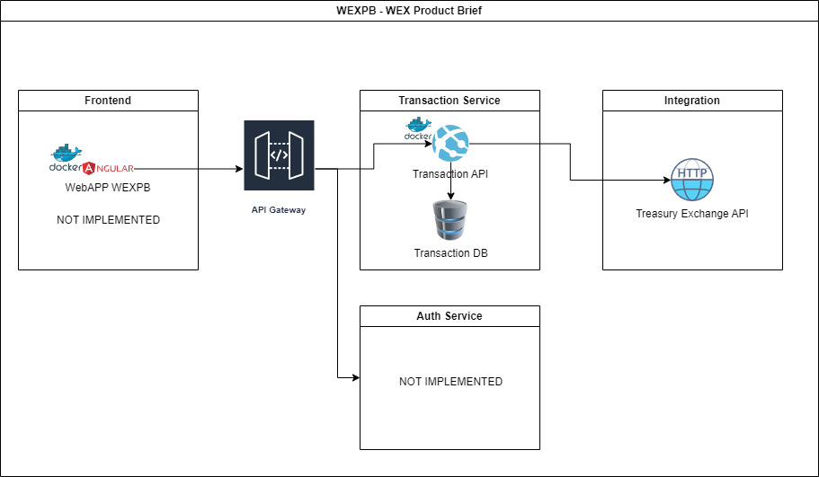

# WEXPB - WEX Product Brief

## Overview
### Requirements:

Requirement #1: Store a Purchase Transaction

Requirement #2: Retrieve a Purchase Transaction in a Specified Country’s Currency

## Architecture

## Implementation

The project was developed using Intellij IDEA, JDK 17, Spring, Gradle and H2 Embedded Database.

## How to Run

Using Intellij IDEA, open the project and run the main class: `com.rcalves.wexpb.WexpbApplication`

Or in terminal, run the command: `java -jar .\WEXPB-0.0.1-SNAPSHOT.jar` in the project root folder. Need to have jdk 17 installed and in system path. 

Or using docker, run the commands (Necessary run build gradle before `./gradlew clean build`):

`docker build -t wexpb .` in the project root folder. Need to have docker installed and running.

`docker run -p 8080:8080 -v C:/Temp/WEXPB/data:/app/data wexpb` 

## How to Test

Using Postman, import the collection `WEXPB.postman_collection.json` and run the tests.

Or using other tool of your preference to do the HTTP requests. 